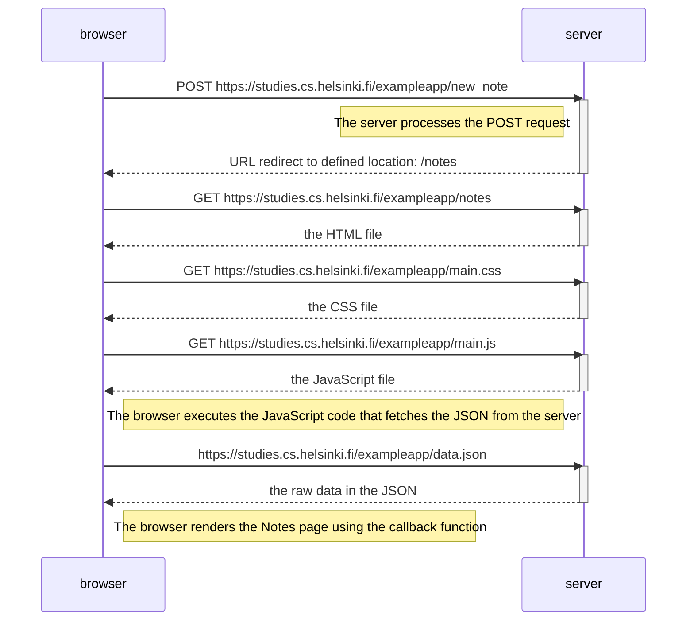

0.4: New note diagram

This is my sequence diagram for when a new note is submitted on the page https://studies.cs.helsinki.fi/exampleapp/notes :

```mermaid
sequenceDiagram
    participant browser
    participant server

    browser->>server: POST https://studies.cs.helsinki.fi/exampleapp/new_note
    activate server

    Note left of server: The server processes the POST request

    server-->>browser: URL redirect to defined location: /notes
    deactivate server

    browser->>server: GET https://studies.cs.helsinki.fi/exampleapp/notes
    activate server
    server-->>browser: the HTML file
    deactivate server

    browser->>server: GET https://studies.cs.helsinki.fi/exampleapp/main.css
    activate server
    server-->>browser: the CSS file
    deactivate server

    browser->>server: GET https://studies.cs.helsinki.fi/exampleapp/main.js
    activate server
    server-->>browser: the JavaScript file
    deactivate server

    Note right of browser: The browser executes the JavaScript code that fetches the JSON from the server

    browser->>server: https://studies.cs.helsinki.fi/exampleapp/data.json
    activate server
    server-->>browser: the raw data in the JSON
    deactivate server

    Note right of browser: The browser renders the Notes page using the callback function
    
```