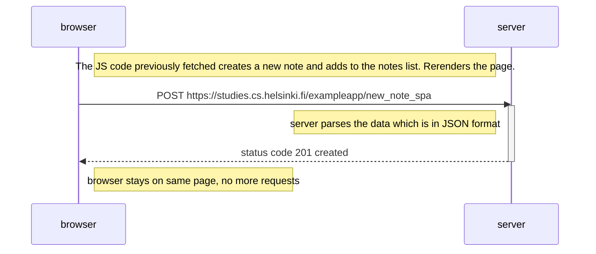

0.6: New note in Single page app diagram

This is my sequence diagram for when a new note is submitted on the page https://studies.cs.helsinki.fi/exampleapp/spa :

```mermaid
sequenceDiagram
    participant browser
    participant server

    Note right of browser: The JS code previously fetched creates a new note and adds to the notes list. Rerenders the page.

    browser->>server: POST https://studies.cs.helsinki.fi/exampleapp/new_note_spa
    activate server

    Note left of server: server parses the data which is in JSON format

    server-->>browser: status code 201 created
    deactivate server

    Note right of browser: browser stays on same page, no more requests
    
```